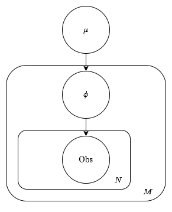

<!-- To get startted:

```
pip install -e ./
```


Dependency:
- Torch 1.13
- Current version of Functorch: https://github.com/facebookresearch/functorch `pip install functorch`

Notes:
- approximate posterior should be independent of data
- On MacOs, you probably need to `export MACOSX_DEPLOYMENT_TARGET=10.9` before installing functorch

TODOs:
- document that you have to be _really_ careful with dimensions in your programme.
- document how to set the dimensions for data!
- More rigorous testing workflow and cases. (e.g. Using unit test framework like pytest)
- More examples for tpp. -->

Probabilistic Programming with Massively Parallel Importance Weighting
=====================================================

This library showcases Massively Parallel Importance Weighting in the context of Variational Inference based probabilistic programming. Using Importance Weighted Autoencoder (IWAE) and Reweighted Wake Sleep (RWS) as inference methods, for a graphical model with $n$ latent variables we can obtain $K^n$ proposals where $K$ is determined by the user. This improves inference performance and allows for...

## A Preview: Fitting a simple gaussian Model

```py
import torch as t
import torch.nn as nn
import tpp

def P(tr):
  '''
  Bayesian Gaussian Model
  '''
  a = t.zeros(5)
  tr.sample('mu', tpp.Normal(a, t.ones(5)))
  tr.sample('obs', tpp.MultivariateNormal(tr['mu'], t.eye(5)))

class Q(tpp.Q):
    def __init__(self):
        super().__init__()
        self.reg_param('m_mu', t.zeros(5))
        self.reg_param('log_s_mu', t.zeros(5))

    def forward(self, tr):
        tr.sample('mu', tpp.Normal(self.m_mu, self.log_s_mu.exp()))

data = tpp.sample(P, varnames=('obs',))

model = tpp.Model(P, Q(), data)

opt = t.optim.Adam(model.parameters(), lr=1E-3)

K=5
for i in range(10000):
    opt.zero_grad()
    elbo = model.elbo(K)
    (-elbo).backward()
    opt.step()
```

Installation from Source
========================

```sh
git clone git@github.com:ThomasHeap/tpp.git
cd tpp
git checkout main  # master is pinned to the latest release
pip install . # pip install .[extras] for running some models in examples/
```

Defining Probabilistic Models
=============================

### Defining $P$

The probabilistic model is defined as a function `P(tr)` with argument `tr` that allows the tracer to collect samples of each latent variable. The usual structure of `P(tr)` is a series of `tr.sample('latent_name', tpp.dist(params))` calls telling the tracer to sample these latents, followed by `tr.sample('obs', tpp.dist(params))` for sampling the observations.

```py
def P(tr):
  tr.sample('first_latent', tpp.dist(params))
  tr.sample('second_latent', tpp.dist(params))
  ...
  tr.sample('obs', tpp.dist(params))
```
where `tpp.dist` is one of the distributions [listed below](#choice-of-distributions)

#### Plated and Grouped latents



You can define the plated model above as so:
```py
sizes = {'plate_1':N, 'plate_2':M}
def P(tr):
    tr.sample('mu',   tpp.MultivariateNormal(t.zeros(5), t.eye(5)))
    tr.sample('phi', tpp.MultivariateNormal(tr['phi'], t.eye(5)), plate='plate_1')
    tr.sample('obs',   tpp.Normal(tr['phi'], 1), plate='plate_2')
```

and you can group latents together:
```py
def P(tr):
    tr.sample('mu',   tpp.MultivariateNormal(t.zeros(5), t.eye(5)), group='group_1')
    tr.sample('phi', tpp.MultivariateNormal(tr['phi'], t.eye(5)), group='group_1')
    tr.sample('psi', tpp.MultivariateNormal(t.zeros(5), t.eye(5)), group='group_2')
    tr.sample('obs',   tpp.Normal(tr['phi'] + tr['psi'], 1))
```

Combinations between the importance samples within groups of latents are not computed. For a model with $n$ latents, $m$ of which are grouped into $k$ groups $(k \leq m)$ there will be $K^{n - m + k}$ importance samples drawn.

### Defining $Q$

The proposal $Q$ is defined as a class inheriting `tpp.Q`. The learnable parameters are defined in `__init__` and in `forward` we define how the latents are sampled and interact.

```py
class Q(tpp.Q):
    def __init__(self):
        super().__init__()
        self.reg_param('m_mu', t.zeros(5))
        self.reg_param('log_s_mu', t.zeros(5))

    def forward(self, tr):
        tr.sample('mu', tpp.Normal(self.m_mu, self.log_s_mu.exp()))
```
as with $P$ the call to sample can take a plate argument, or the learnable parameters can take the plate structure into account:

```py
sizes = {'plate_1':N, 'plate_2':M}
class Q(tpp.Q):
    def __init__(self):
        super().__init__()
        self.reg_param("m_mu", t.zeros(()))
        self.reg_param("log_s_a", t.zeros(()))

        self.reg_param("m_phi", t.zeros((N)), ['plate_1])
        self.reg_param("log_s_phi", t.zeros((N)), ['plate_1])

    def forward(self, tr):
        tr.sample('mu', tpp.Normal(self.m_mu, self.log_s_mu.exp()))
        tr.sample('phi', tpp.Normal(self.m_phi, self.log_s_phi.exp()))
```

### Choice of distributions
Choices for `tpp.dist` include most distributions listed in https://pytorch.org/docs/stable/distributions.html:

- `tpp.Bernoulli`
- `tpp.Beta`
- `tpp.Binomial`
- `tpp.Categorical`
- `tpp.Cauchy`
- `tpp.Chi2`
- `tpp.ContinuousBernoulli`
- `tpp.Exponential`
- `tpp.FisherSnedecor`
- `tpp.Gamma`
- `tpp.Geometric`
- `tpp.Gumbel`
- `tpp.HalfCauchy`
- `tpp.HalfNormal`
- `tpp.Kumaraswamy`
- `tpp.LKJCholesky`
- `tpp.Laplace`
- `tpp.LogNormal`
- `tpp.LowRankMultivariateNormal`
- `tpp.Multinomial`
- `tpp.MultivariateNormal`
- `tpp.NegativeBinomial`
- `tpp.Normal`
- `tpp.Pareto`
- `tpp.Poisson`
- `tpp.RelaxedBernoulli`
- `tpp.RelaxedOneHotCategorical`
- `tpp.StudentT`
- `tpp.Uniform`
- `tpp.VonMises`
- `tpp.Weibull`
- `tpp.Wishart`

Note: For models with discrete latents only the [RWS](#reweighted-wake-sleep) inference method is supported.


Inference Methods
=================

We support two objective functions for inference:

## Evidence Lower Bound (IWAE)
In the training loop:
```py
K=5
for i in range(10000):
    opt.zero_grad()
    elbo = model.elbo(K)
    (-elbo).backward()
    opt.step()
```

## Reweighted Wake Sleep
We support wake theta and phi loss. (See [The paper](link_to_the_paper) for more information).
```py
K=5
for i in range(10000):
    opt.zero_grad()
    wake_theta_loss, wake_phi_loss = model.rws(K=K)
    (-wake_theta_loss + wake_phi_loss).backward()
    opt.step()
```
